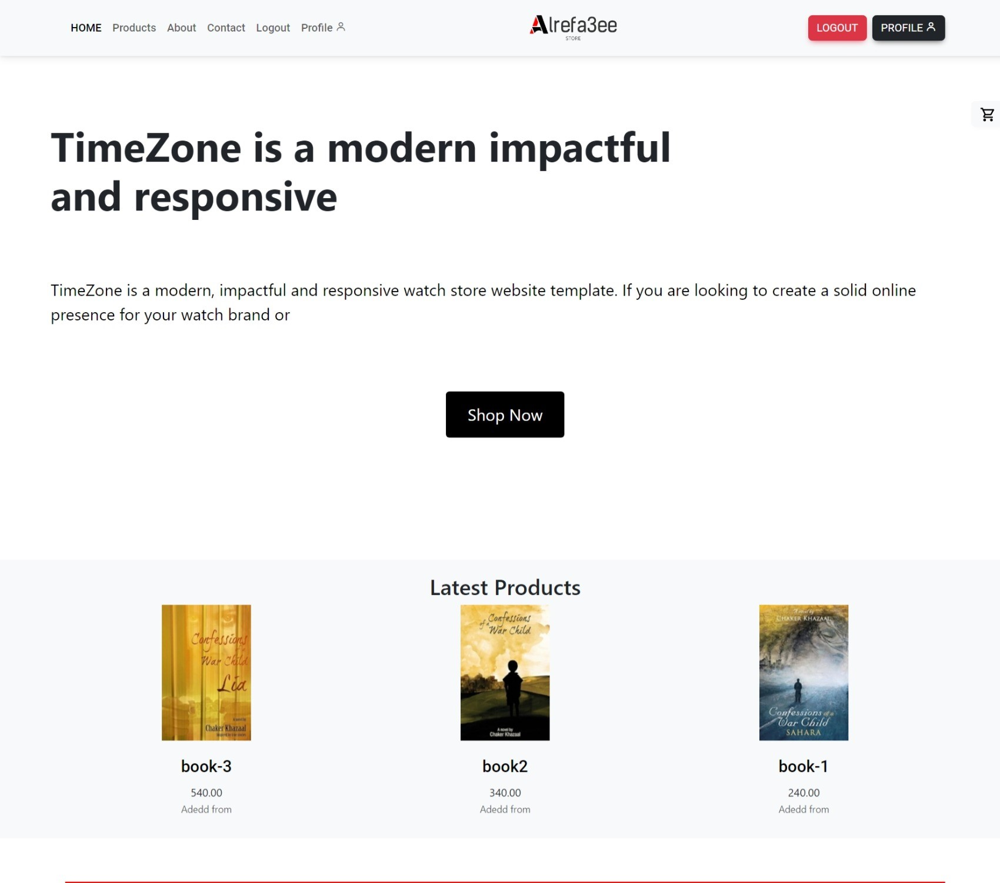

<div id="top"></div>

<br />
<div align="center">
  <a href="https://github.com/Alrefa3ee">
    
  </a>

  <h3 align="center">Dr.Store</h3>

  <p align="center">
    E-commerce WebSite Made use Django , React
    <br />
    <br />
    <br />
    <a href="#">View Demo</a>
    ·
    <a href="https://github.com/Alrefa3ee/Dr.Store/issues">Report Bug</a>
    ·
    <a href="https://github.com/Alrefa3ee/Dr.Store/issues">Request Feature</a>
  </p>
</div>


<!-- ABOUT THE PROJECT -->
## About The Project



# Ecommerce Website for Seamless Online Shopping

Built with Django and React, this dynamic ecommerce platform provides a smooth and engaging user experience.

## Key Features:

Robust Backend: Django handles data management, user interactions, and secure transactions efficiently.
Rich Frontend: React delivers a highly responsive and interactive user interface, optimizing the shopping experience.
Seamless Integration: Django and React work together harmoniously to create a cohesive and efficient web application.
Developer: Crafted with expertise by Alrefa3ee.
## Get Started:

### Installation

1. Clone the repo
   ```sh
   git clone https://github.com/Alrefa3ee/Dr.Store.git
   ```
2. Install NPM packages
   ```sh
   cd frontend && npm i
   ```
3. Install Django dependencies
   ```sh
   pip install -r requirements.txt
   ```
## Usage 
1. start Frontend
   ```sh
   cd frontend && npm run dev
   ```
2. setup Backend
   ```sh
   cd djoserauthapi 
   ```
   ```sh
   python manage.py makemigrations
   ```
   ```sh
   python manage.py migrate
   ```


## License

Distributed under the MIT License. See `LICENSE.txt` for more information.

<p align="right">(<a href="#top">back to top</a>)</p>


## Contact

Your Name - [@twitter_handle](https://twitter.com/twitter_handle) - email@email_client.com

Project Link: [https://github.com/github_username/repo_name](https://github.com/github_username/repo_name)

<p align="right">(<a href="#top">back to top</a>)</p>
